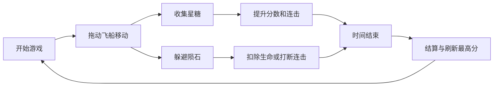

# 《星糖冲刺》2D 手机 Web 小游戏 PRD

**版本:** v1.0
**日期:** 2026-05-26
**类型:** 2D 竖屏轻量街机收集游戏
**平台:** 手机 Web / H5
**目标设备:** iOS Safari、Android Chrome、微信内置浏览器
**建议画布:** 逻辑分辨率 750 x 1334，按设备等比缩放

---

## 1. 项目概述

### 1.1 一句话定位

玩家单指拖动一只小飞船，在 60 秒内躲避障碍、收集星糖、触发连击加成，争取刷新最高分。

### 1.2 设计目标

| 目标 | 说明 |
|---|---|
| 上手成本低 | 首局 3 秒内理解“拖动移动、吃星糖、躲障碍”。 |
| 单局足够短 | 标准局 60 秒，适合碎片时间。 |
| 可复玩 | 通过随机刷物、连击和最高分驱动重复挑战。 |
| 开发可控 | 仅使用 Canvas 2D、前端本地数据，不依赖后端。 |

### 1.3 目标用户

- 休闲小游戏玩家
- 手机 Web 活动页用户
- 想要 1 分钟内完成一局轻度挑战的用户

### 1.4 核心体验

1. 进入主页，点击开始。
2. 倒计时 3 秒后进入游戏。
3. 玩家拖动飞船左右移动。
4. 收集星糖得分，连续收集触发 Combo。
5. 撞到陨石扣生命，生命为 0 或时间结束后结算。
6. 结算页展示分数、最高分、评级和重开按钮。

---

## 2. 游戏规则

### 2.1 核心循环



### 2.2 操作方式

| 输入 | 行为 | 备注 |
|---|---|---|
| 单指按住并拖动 | 飞船跟随手指横向移动 | 默认只改变 X 坐标，Y 坐标固定在屏幕下方 78%。 |
| 松手 | 飞船保持当前位置 | 不暂停游戏。 |
| 点击暂停按钮 | 暂停游戏 | 展示暂停弹窗。 |

### 2.3 胜负与结算

| 条件 | 结果 |
|---|---|
| 倒计时归零 | 正常结算。 |
| 生命值归零 | 提前结束并结算。 |
| 分数超过历史最高分 | 更新本地最高分。 |

### 2.4 分数规则

| 行为 | 分数 |
|---|---:|
| 收集普通星糖 | +10 |
| 收集金色星糖 | +50 |
| Combo 每达到 10 个 | 进入 5 秒 Fever 模式 |
| Fever 模式收集普通星糖 | +20 |
| 撞到陨石 | -1 生命，Combo 清零 |

### 2.5 难度曲线

| 时间段 | 星糖刷出间隔 | 陨石刷出间隔 | 下落速度 |
|---|---:|---:|---:|
| 0-15 秒 | 0.65s | 1.40s | 320 px/s |
| 16-35 秒 | 0.55s | 1.10s | 390 px/s |
| 36-60 秒 | 0.45s | 0.85s | 470 px/s |

---

## 3. 数据设计

### 3.1 运行时状态

```typescript
type GamePhase =
  | 'home'
  | 'countdown'
  | 'playing'
  | 'paused'
  | 'result';

interface GameRuntimeState {
  phase: GamePhase;
  elapsedMs: number;
  remainingMs: number;
  score: number;
  combo: number;
  feverRemainingMs: number;
  player: PlayerState;
  entities: EntityState[];
  randomSeed: number;
}
```

### 3.2 玩家数据

```typescript
interface PlayerState {
  x: number;
  y: number;
  width: number;
  height: number;
  hp: number;
  maxHp: number;
  invincibleRemainingMs: number;
  skinId: string;
}
```

### 3.3 实体数据

```typescript
type EntityType = 'star_candy' | 'gold_candy' | 'meteor' | 'shield';

interface EntityState {
  id: string;
  type: EntityType;
  x: number;
  y: number;
  width: number;
  height: number;
  vy: number;
  collected: boolean;
}
```

### 3.4 本地存档

```typescript
interface LocalSaveData {
  version: 1;
  highScore: number;
  totalRounds: number;
  totalScore: number;
  selectedSkinId: string;
  unlockedSkinIds: string[];
  audioMuted: boolean;
  hapticEnabled: boolean;
  updatedAt: string;
}
```

**localStorage Key:** `star-candy-dash-save-v1`

### 3.5 配置表

#### 玩家配置

| 字段 | 值 | 说明 |
|---|---:|---|
| 初始生命 | 3 | 撞到陨石扣 1。 |
| 碰撞无敌 | 1200ms | 受伤后短暂无敌，避免连续扣血。 |
| 基准宽度 | 72px | 逻辑分辨率下的碰撞盒宽度。 |
| 基准高度 | 88px | 逻辑分辨率下的碰撞盒高度。 |
| 初始 Y 坐标 | 1040px | 750 x 1334 逻辑画布下的位置。 |

#### 物件配置

| ID | 类型 | 出现权重 | 分数/效果 | 碰撞盒 | 备注 |
|---|---|---:|---|---|---|
| `star_candy` | 收集物 | 72 | +10 分 | 48 x 48 | 主要得分来源。 |
| `gold_candy` | 收集物 | 10 | +50 分 | 54 x 54 | 稀有高价值物。 |
| `shield` | 道具 | 4 | 5 秒护盾 | 56 x 56 | 护盾期间撞陨石不扣血。 |
| `meteor` | 障碍 | 35 | -1 生命 | 76 x 76 | 打断 Combo。 |

#### 评级配置

| 分数区间 | 评级 | 文案 |
|---:|---|---|
| 0-499 | C | 初次起飞 |
| 500-999 | B | 稳定巡航 |
| 1000-1599 | A | 星糖猎手 |
| 1600+ | S | 银河传说 |

---

## 4. 界面设计

### 4.1 页面状态

| 页面 | 触发时机 | 主要元素 | 主要操作 |
|---|---|---|---|
| 首页 | 打开游戏 | 标题、最高分、开始按钮、静音按钮 | 开始游戏、切换静音 |
| 倒计时 | 点击开始后 | 3、2、1、GO | 无 |
| 游戏中 | 倒计时结束 | 分数、时间、生命、暂停按钮、游戏画布 | 拖动移动、暂停 |
| 暂停弹窗 | 点击暂停 | 继续、重新开始、返回首页 | 继续/重开/返回 |
| 结算页 | 游戏结束 | 本局分数、最高分、评级、重玩按钮 | 再来一局、返回首页 |

### 4.2 首页布局

```text
┌────────────────────────┐
│        星糖冲刺         │
│    Star Candy Dash     │
│                        │
│      最高分  1280       │
│                        │
│      [ 开始游戏 ]       │
│                        │
│     🔊 音效   📳 震动    │
└────────────────────────┘
```

### 4.3 游戏中 HUD

```text
┌────────────────────────┐
│ 分数 0820   00:42   ♥♥♡ │
│                    暂停 │
│                        │
│       星糖 / 陨石区域    │
│                        │
│                        │
│          飞船           │
│     手指拖动横向移动     │
└────────────────────────┘
```

### 4.4 结算页布局

```text
┌────────────────────────┐
│         游戏结束         │
│           A             │
│      本局分数  1240      │
│      最高分    1600      │
│                        │
│      [ 再来一局 ]        │
│      [ 返回首页 ]        │
└────────────────────────┘
```

### 4.5 视觉风格

| 项目 | 规范 |
|---|---|
| 画面方向 | 竖屏，背景持续向下滚动。 |
| 主色 | 深蓝紫夜空 `#15192E`。 |
| 强调色 | 星糖金 `#FFD166`、护盾青 `#4ECDC4`、危险红 `#FF6B6B`。 |
| 角色 | 圆润小飞船，形状简单，碰撞边界清晰。 |
| 动效 | 星糖轻微浮动，收集时缩放消失，受伤时飞船闪烁。 |

### 4.6 关键反馈

| 事件 | 反馈 |
|---|---|
| 收集星糖 | 粒子闪光、分数飘字、轻音效。 |
| Combo 增加 | Combo 数字放大 120ms。 |
| 进入 Fever | HUD 边缘发光，背景速度感增强。 |
| 撞到陨石 | 屏幕轻微震动、生命扣除、飞船闪烁。 |
| 破纪录 | 结算页展示“新纪录”。 |

---

## 5. 技术方案

### 5.1 前端实现建议

| 模块 | 建议 |
|---|---|
| 渲染 | Canvas 2D。 |
| UI | React 负责页面状态、按钮、弹窗；Canvas 负责游戏画面。 |
| 状态 | 轻量本地状态即可，运行时状态不持久化。 |
| 存档 | localStorage 保存最高分、设置和皮肤选择。 |
| 资源 | PNG/WebP 精灵图、MP3/OGG 音效。 |
| 性能 | `requestAnimationFrame` 主循环，固定时间步更新。 |

### 5.2 游戏循环

```typescript
function tick(deltaMs: number) {
  updateTimer(deltaMs);
  updatePlayerInput(deltaMs);
  spawnEntities(deltaMs);
  updateEntities(deltaMs);
  resolveCollisions();
  renderFrame();
}
```

### 5.3 碰撞规则

- 使用 AABB 矩形碰撞。
- 碰撞盒小于素材外观 10%-20%，降低误伤感。
- 玩家处于无敌或护盾状态时，陨石碰撞只播放反馈，不扣生命。
- 物件离开屏幕底部后立即回收。

### 5.4 资源清单

| 资源 | 数量 | 说明 |
|---|---:|---|
| 背景图 | 2 | 可循环的星空背景前后景。 |
| 飞船 | 1-3 | 默认皮肤，后续可扩展皮肤。 |
| 星糖 | 2 | 普通、金色。 |
| 陨石 | 2 | 小陨石、大陨石。 |
| 护盾 | 1 | 道具图标和游戏内实体。 |
| 音效 | 5 | 点击、收集、受伤、Fever、结算。 |

---

## 6. 埋点与数据指标

### 6.1 本地统计

| 指标 | 来源 | 用途 |
|---|---|---|
| 最高分 | localStorage | 主页和结算页展示。 |
| 总局数 | localStorage | 判断用户熟练度。 |
| 总分 | localStorage | 后续扩展累计成就。 |

### 6.2 可选埋点

| 事件名 | 触发时机 | 参数 |
|---|---|---|
| `game_start` | 点击开始 | `roundId`, `highScore` |
| `item_collect` | 收集物件 | `itemType`, `combo`, `score` |
| `player_hit` | 撞到陨石 | `hpLeft`, `elapsedMs` |
| `fever_start` | 进入 Fever | `combo`, `elapsedMs` |
| `game_end` | 结算 | `score`, `durationMs`, `rank`, `isNewRecord` |

---

## 7. 边界与异常

| 场景 | 处理 |
|---|---|
| 页面切到后台 | 自动暂停游戏。 |
| 屏幕旋转为横屏 | 展示竖屏提示，暂停游戏。 |
| localStorage 不可用 | 正常游戏，但不保存最高分。 |
| 帧率低于 30 FPS | 降低粒子数量，不影响核心碰撞。 |
| 多点触控 | 只响应第一个触点。 |

---

## 8. 验收标准

### 8.1 功能验收

- 用户可以从首页开始一局游戏。
- 玩家可以通过单指拖动控制飞船横向移动。
- 星糖、金色星糖、陨石、护盾可以按配置刷出。
- 收集物和障碍可以正确触发分数、生命、Combo、护盾效果。
- 60 秒倒计时结束后进入结算页。
- 生命为 0 时提前进入结算页。
- 最高分可以保存并在下次打开时展示。

### 8.2 体验验收

- 首屏在手机 4G 网络下 3 秒内可交互。
- 游戏中 HUD 不遮挡玩家主体和主要物件。
- 玩家受伤后能明确感知扣血原因。
- 单局平均时长不超过 65 秒。
- iPhone 13、主流 Android 1080p 设备上保持接近 60 FPS。

### 8.3 开发边界

- v1.0 不接入账号系统。
- v1.0 不做排行榜后端。
- v1.0 不做内购和广告。
- v1.0 不做复杂关卡编辑器。

---

## 9. 后续扩展

| 扩展方向 | 价值 |
|---|---|
| 皮肤解锁 | 增加长期目标。 |
| 每日挑战 | 提升回访。 |
| 分享海报 | 适合活动传播。 |
| 远程排行榜 | 增加竞争感。 |
| 关卡主题 | 用不同背景和障碍包装内容活动。 |

