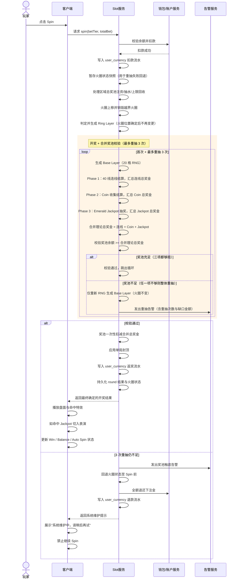
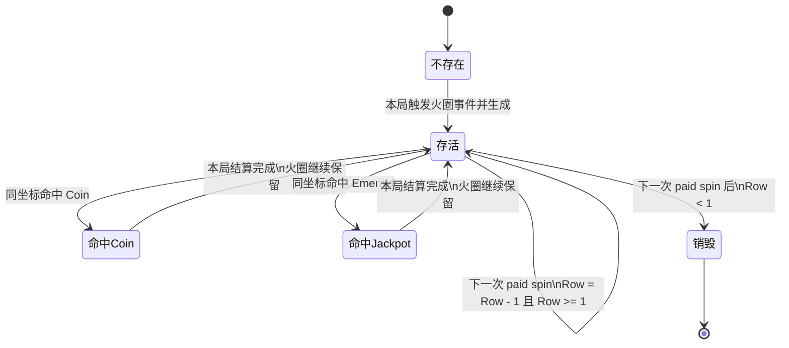
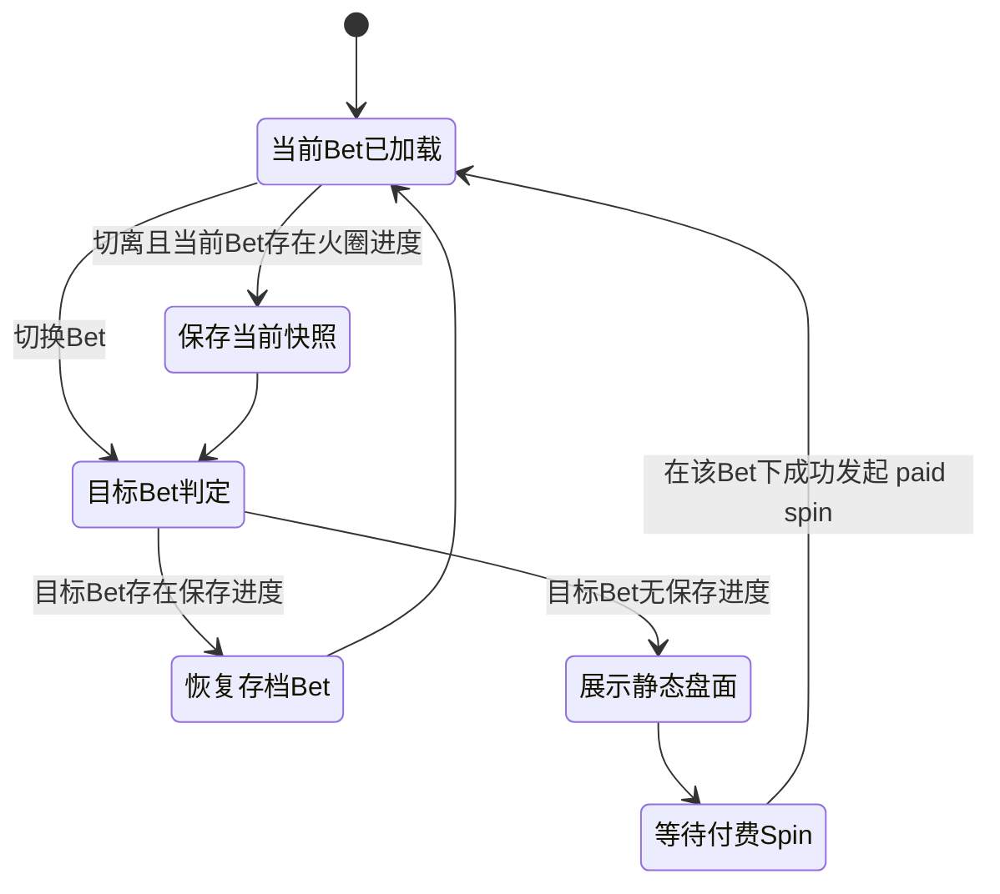
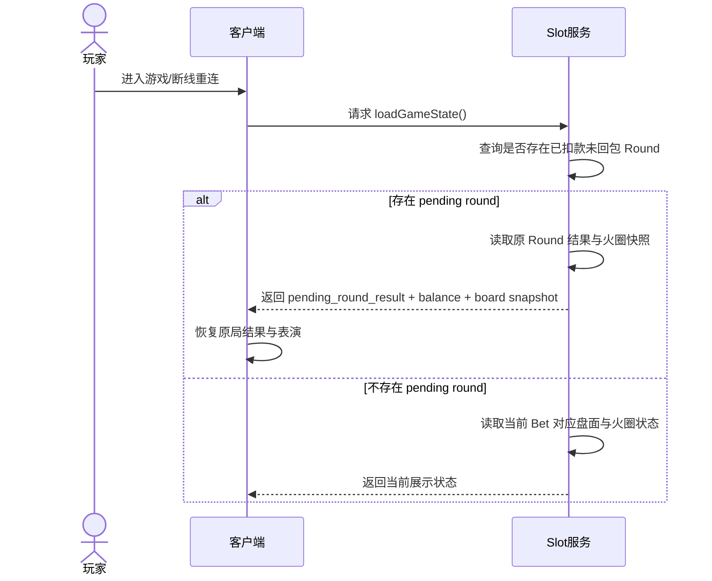

# 金字塔 Slot 复刻开发 PRD

## 文档说明
- **项目名称**：金字塔 Slot
- **文档类型**：完整开发 PRD
- **文档日期**：2026-03-23
- **最近更新**：2026-04-07
- **原始输入来源**：用户提供的游戏截图、规则脑图、核心开奖逻辑说明，以及多轮澄清结论
- **输出目标**：产出一份可直接支持客户端、服务端、测试与后续 AI coding 拆解的 Markdown PRD
- **文档状态**：关键实现口径已确认，可进入开发拆解

## 需求变更记录

| 版本号 | 变更时间 | 变更内容 | 变更点位置 |
|---|---|---|---|
| V1.9 | 2026-04-07 | 1. 新增 Win 数值逐步累加展示规则：连线→Coin→Jackpot 三步分别累加 Win 区域数值，配合数字滚动动画 2. 明确大奖弹窗在三步 Win 累加完毕后整局判定一次，不在每步之后判定 3. 接口新增 `line_win_total` / `coin_win_total` / `jackpot_win_total` 分步奖金字段 | 1. 5.3 底部操作区域（引用 5.6） 2. 5.6 Win 数值逐步累加展示（新增） 3. 12.9.1 大奖通知播放时机（补充说明） 4. 20.1 接口返回字段 5. 23.1 客户端验收 6. 23.2 服务端验收 |
| V1.8 | 2026-04-07 | 1. 新增大奖弹窗播报（Big/Mega/Super/Epic Win），基于 final_total_win / total_bet 倍数触发，仅本人可见 2. 新增全服横幅通知，接入已有全服横幅服务，final_total_win >= 20万金币触发 3. 大奖弹窗与全服横幅独立判定、互不排斥 4. 大奖弹窗触发时 Auto Spin 停止 5. 新增 19.13 / 19.14 配置表模板 6. 新增 US-007 / US-008 用户故事 | 1. 2 功能清单（新增2行） 2. 7.1 单局执行流程（新增步骤11） 3. 12.9 大奖通知与全服横幅（新增） 4. 15.3 Auto Spin 停止条件 5. 15.4 停止后行为 6. 19.13-19.14 配置表模板（新增） 7. 20.1 接口返回字段 8. 21 数据埋点 9. 22 用户故事（US-007/US-008） 10. 23.1-23.2 验收标准 |
| V1.7 | 2026-04-07 | 1. 奖池校验从"三阶段各自独立校验"改为"三阶段合并校验、整体重抽" 2. 取消 Coin 跳过机制（原 Phase 2 逐个校验跳过） 3. 取消 Jackpot 降档与吞 Token 机制（原 Phase 3 固定降档） 4. 重抽范围：仅重抽 Base Layer（火圈不变），最多 3 次 5. 3 次失败后退款+系统维护+告警（与旧版一致） 6. 合并校验通过后一次性原子扣减奖池 7. 移除降档/吞Token/Coin跳过相关埋点，新增统一重抽埋点 | 1. 7.1 单局执行流程 2. 7.2 单局时序图 3. 10.6 奖池校验说明 4. 11.3 Coin 金额计算 5. 12.4 Jackpot 金额计算 6. 12.7 奖池不透支原则（全面重写） 7. 16.1 服务端权威原则 8. 16.2 事务顺序 9. 20.1 接口返回字段 10. 21 数据埋点 11. 23.2-23.3 验收标准 12. 24.6-24.8 风险与限制 13. 差异摘要与结论 |
| V1.6 | 2026-04-03 11:28:22 | 1. 14.2 补充盘面快照字段定义（Base Layer 图案 + Coin 绑定倍数，不含结算结果） 2. 14.3 补充"恢复盘面仅用于展示，不重新结算" | 1. 14.2 切出当前 Bet 时 2. 14.3 切回原 Bet 时 |
| V1.5 | 2026-04-03 11:08:02 | 1. 将 19.4~19.10 所有配置表从"示例行"升级为"首版确认数值" 2. 19.4 赔率表新增 `payout_type = 固定注数` 字段 3. 19.5 概率表补充每列概率合计 = 1.000 校验行与说明 4. 19.6 Coin 倍数池补充加权期望 = 2.9 5. 19.8 火圈数量池补充加权期望 = 4.50 6. 19.9 合并 Jackpot 概率与倍数为一张表，补充宝石倍数加权期望 = 18.75 | 1. 19.4 普通图案赔率表 2. 19.5 Base Layer 图案概率配置表 3. 19.6 Coin 倍数池 4. 19.7 火圈触发配置 5. 19.8 火圈数量池 6. 19.9 Jackpot 档位概率配置（宝石倍数表） 7. 19.10 Jackpot 倍数配置 |
| V1.4 | 2026-04-03 10:53:56 | 1. 补充完整 40 条赔付线路径坐标（根据原始游戏 RING PLAY 截图逐条还原） 2. 替换原 19.3 中的 2 条示例行为完整 40 条首版确认数据 | 1. 19.3 Payline 配置模板 |
| V1.3 | 2026-04-02 11:49:47 | 1. 确立"平台不透支奖池"原则，所有奖金（连线/Coin/Jackpot）均从奖池出资并前置校验余额 2. Phase 1 连线不足时仅重抽 Base Layer（最多3次），3次失败则退款+系统维护 3. Phase 2 Coin 逐个串行校验，不足则视为火圈未覆盖 4. Phase 3 Jackpot 不足时固定降档 GRAND→MAJOR→MINOR→MINI，四档全不足则吞Token 5. 三阶段严格串行扣减奖池 6. 新增奖池触底告警机制 7. 新增 `slot_bet_refund` 退款流水类型 8. 新增高并发奖池竞争风险说明 | 1. 12.7 奖池不透支原则与余额前置校验（全面重写） 2. 7.1 单局执行流程 3. 7.2 单局时序图 4. 10.6 连线奖池校验与重抽机制（新增） 5. 11.3 Coin 金额计算 6. 12.4 Jackpot 金额计算 7. 16.2 事务顺序 8. 17.4 货币流水 biz_type 9. 21 数据埋点（新增6项） 10. 23.2-23.3 验收标准 11. 24.6-24.8 风险与限制（新增3项） |
| V1.2 | 2026-03-31 20:24:21 | 1. 写入首版确认的图案赔付与 Base Layer 概率数值 2. 写入 Coin 倍数池、火圈触发概率、火圈数量池、Emerald Jackpot 档位概率与倍数数值 3. 补充下注档位配置，并将相关配置字段调整为更适合 AI coding 的结构 | 1. 19.2 Bet 档位配置模板 2. 19.4-19.10 配置表模板 3. 8.4 可配置要求 4. 9.1-9.2 火圈生成规则 5. 12.3-12.4 Emerald Jackpot 结算 |
| V1.1 | 2026-03-31 20:14:31 | 1. 补充历史记录列表展示与查询口径 2. 新增按大区共享的单一区域总奖池规则 3. 新增初始注入、抽水比例、奖池下限、奖池上限与溢出回收规则 4. 明确 Slot 扣款与返奖写入 `user_currency`，并补充旧上报迁移口径 | 1. 5.5 历史记录页 2. 12.5 区域总奖池规则 3. 12.6 奖池注资、抽水与上下限规则 4. 17.4 货币流水要求 |
| V1.0 | 2026-03-23 00:00:00 | 1. 初次生成 PRD 2. 完成背景、功能清单、玩法规则、配置模板、接口建议与验收标准整理 | 1. 全文 2. 全文 |

### 标注图例
- ✅ 与原始输入一致
- 🔄 基于澄清后的规则补充
- ➕ 工程落地必需的隐含需求补足
- ❌ 本期不做

### 与原始输入主要差异摘要
- 🔄 明确 **Jackpot 奖金口径 = 固定倍数 × Total Bet**，而非固定奖池金额
- 🔄 明确 **火圈状态按 Bet 档位隔离保存**，切回原 Bet 时恢复原盘面
- 🔄 明确切到无火圈进度的 Bet 档位时，展示 **随机静态盘面**，不扣费、不结算、不产生进度
- 🔄 明确 **Auto Spin** 默认停止条件：手动停止 / 余额不足 / 请求异常 / 触发 Jackpot 表演
- 🔄 明确 **单局封顶** 采用 `max_win_multiplier × Total Bet`
- 🔄 明确火圈空位不足时，按 **可用空位数截断**
- ➕ 补充 **历史记录列表字段**：结算时间、下注金额、中奖金额
- 🔄 明确 **Jackpot 真实资金池** 为按大区共享的单一区域总奖池；前台 4 档仍为奖励档位展示
- ➕ 支持 **初始奖池注入、抽水比例、奖池下限、奖池上限与溢出回收**
- ➕ 明确 **Slot 扣款/派奖必须写入 `user_currency`**，旧租用版上报需纳入迁移评估
- 🔄 写入 **首版确认数值**：图案赔率、列概率、Coin 倍数池、火圈触发概率、火圈数量池、Jackpot 档位概率与倍数、下注档位
- ➕ 明确服务端补单、幂等、状态持久化、配置模板与图示说明
- ➕ 新增 **大奖弹窗播报**（Big/Mega/Super/Epic Win），基于中奖倍数触发，仅本人可见
- ➕ 新增 **全服横幅通知**，接入已有全服横幅服务，中奖金额 >= 20 万金币时全服推送
- 🔄 确立 **奖池不透支原则**：所有奖金从奖池出资，服务端前置校验余额，不足则整体重抽/不开
- 🔄 三阶段合并校验：**连线 + Coin + Jackpot 理论总奖金一次性校验**，任一项不够则整体重抽 Base Layer（最多 3 次），3 次失败则退款 + 系统维护
- 🔄 **取消** Coin 跳过、Jackpot 降档与吞 Token 机制
- ➕ 新增 **奖池触底告警机制** 与 **高并发奖池竞争风险** 说明

---

## 1. 背景与目标

### 1.1 背景 ✅
该游戏是一个金字塔主题的 5x4 盘面 Slot。与传统单层连线 Slot 相比，其核心体验不仅来自普通图案连线，还来自跨回合持续存在的火圈层，以及火圈与特殊图案发生空间重合后的额外奖励。

核心玩法吸引力主要来自以下四点：
1. 普通图案通过 40 条固定赔付线提供基础中奖反馈
2. 火圈在多局之间持续向上移动，形成“追逐式期待”
3. 火圈覆盖 Coin 时，直接放大本局奖励
4. 火圈覆盖 Emerald 时，触发 Jackpot 抽奖与独立表演

本项目目标是在尽量贴近参考游戏表现与节奏的前提下，将核心玩法、状态机、补单逻辑、Bet 切换规则与异常场景补足为可执行文档，避免研发和测试在实现阶段自行脑补关键规则。

### 1.2 本期目标 ✅
- 复刻主盘面、开奖流程与核心经济规则
- 复刻火圈跨回合流转机制
- 复刻 Coin 收集与 Emerald Jackpot 奖励机制
- 补充历史记录查询与展示口径
- 补充按大区维度共享的区域总奖池规则
- 输出完整的客户端、服务端、测试验收口径
- 将核心数值全部收敛为可配置结构，便于后续调参

### 1.3 目标用户 ✅
| 角色 | 说明 |
|------|------|
| 普通 Slot 玩家 | 关注转动反馈、中奖爽感与规则易懂性 |
| 高频玩家 | 关注火圈积累、Jackpot 触发与不同 Bet 体验 |
| 数值运营人员 | 需要通过配置表调节 RTP、中奖节奏与大奖体感 |

---

## 2. 功能清单

| 模块 | 功能项 | 类型 | 标注 |
|------|--------|------|------|
| 主游戏 | 5x4 盘面展示 | 新建 | ✅ |
| 主游戏 | 40 固定赔付线结算 | 新建 | ✅ |
| 主游戏 | Base Layer 独立格子 RNG | 新建 | ✅ |
| 主游戏 | Ring Layer 两步判定生成 | 新建 | ✅ |
| 主游戏 | Coin 倍数收集 | 新建 | ✅ |
| 主游戏 | Emerald Jackpot 抽奖 | 新建 | ✅ |
| 状态系统 | 火圈跨回合上移与销毁 | 新建 | ✅ |
| 状态系统 | 火圈按 Bet 档位隔离存储 | 新建 | 🔄 |
| 操作区 | Bet 调节 | 新建 | ✅ |
| 操作区 | Spin / Auto Spin | 新建 | ✅ |
| 客户端表现 | Jackpot 顶部展示 | 新建 | ✅ |
| 客户端表现 | 命中火圈 / Jackpot 表演 | 新建 | ✅ |
| 历史记录 | 局记录列表展示 | 新建 | ➕ |
| 恢复机制 | 已扣款未回包补单 | 新建 | 🔄 |
| 恢复机制 | 断线重连恢复盘面和状态 | 新建 | ✅ |
| 安全与经济 | 单局封顶 | 新建 | 🔄 |
| 安全与经济 | 区域总奖池 | 新建 | ➕ |
| 安全与经济 | 奖池抽水 / 下限 / 上限回收 | 新建 | ➕ |
| 数据与对账 | `user_currency` 流水写入 | 新建 | ➕ |
| 中奖通知 | 大奖弹窗播报（Big/Mega/Super/Epic Win） | 新建 | ➕ |
| 中奖通知 | 全服横幅通知 | 对接已有服务 | ➕ |
| 帮助系统 | Paytable / Help | 新建 | ✅ |

---

## 3. 产品范围

### 3.1 本期范围 ✅
本期包含以下内容：
- 主游戏盘面
- Jackpot 顶部展示区
- Bet 调节
- 单次 Spin
- 长按进入 Auto Spin
- Win 信息区与余额展示
- Paytable / Help
- 历史记录列表
- 火圈状态持久化
- Bet 切换恢复规则
- 断线重连与补单
- 基础异常提示
- 区域总奖池配置与结算规则
- 货币流水写入与旧上报兼容口径
- 大奖弹窗播报（Big Win / Mega Win / Super Win / Epic Win）
- 全服横幅通知（接入已有全服横幅服务）

### 3.2 本期不包含 ❌
本期不做以下内容：
- Free Spin
- Bonus Game
- Respin
- 跨游戏 Progressive 公共奖池联动
- 活动任务系统
- 商城与外部商业化模块
- 社交玩法联动
- 多钱包体系改造

---

## 4. 术语定义

| 术语 | 定义 |
|------|------|
| Base Layer | 底层图案层，每次付费 Spin 时重新生成 |
| Ring Layer | 火圈覆盖层，可跨回合保留 |
| Coin | 金币特殊图案，被火圈覆盖后按倍数发奖 |
| Emerald | 绿宝石特殊图案，被火圈覆盖后触发 Jackpot 抽奖 |
| Wild | 百搭图案，仅替代普通图案，不替代 Coin / Emerald |
| Total Bet | 当前一局总下注额 |
| Bet Tier | 下注档位；火圈与盘面状态按该档位隔离 |
| Region | 玩家所属大区；本游戏按大区维度隔离真实总奖池 |
| Regional Jackpot Pool | 同一 Region 内所有玩家共享的单一区域总奖池 |
| Rake Ratio | 抽水比例；每局下注中被平台回收、不注入奖池的比例 |
| Static Preview Board | 非付费展示盘面，不参与结算、不产生状态 |
| Round | 一次完整的已扣款 Spin 事务 |
| user_currency | 平台货币流水表，用于记录扣款、返奖等余额变动 |

---

## 5. 主界面与信息架构

### 5.1 顶部区域 ✅
展示 4 档 Jackpot：
- GRAND
- MAJOR
- MINOR
- MINI

显示金额规则：
- 顶部展示金额 = `当前档位倍数 × 当前 Total Bet`
- 玩家切换 Bet 后，顶部显示值需立即刷新
- 顶部 4 档金额是奖励档位预览，不等于 4 个独立资金池
- Jackpot 实际资金统一由玩家所属 Region 的 `Regional Jackpot Pool` 承担

### 5.2 中部盘面区域 ✅
- 盘面为 5 列 × 4 行
- Base Layer 负责展示图案本体
- Ring Layer 作为覆盖层显示在格子上方
- 需要支持火圈掉落、火圈上移、命中特效、Jackpot 表演切入

### 5.3 底部操作区域 ✅
包含：
- Bet 调节按钮（+ / -）
- 当前 Win 信息（详见 5.6）
- 当前余额 Balance
- Spin 按钮
- 长按进入 Auto Spin

### 5.4 Help / Paytable 页面 ✅
必须展示：
- 11 个普通图案赔率表
- Wild 规则说明
- Coin 倍数池说明
- Emerald Jackpot 档位说明
- 火圈机制说明
- 40 条固定赔付线图示
- Auto Spin 停止条件说明

### 5.5 历史记录页 ➕
- 列表至少展示：`结算时间`、`下注金额`、`中奖金额`
- 按已结算 Round 倒序展示最新记录
- 未中奖局的 `中奖金额` 展示为 `0`
- 仅展示当前游戏的历史记录，不混入其他概率游戏记录

### 5.6 Win 数值逐步累加展示 ➕

单局结算过程中，Win 区域的数值展示按以下三步依次累加，让玩家体验中奖金额逐步增长的快感：

| 阶段 | 展示行为 | Win 数值变化 |
|------|----------|-------------|
| Phase 1 连线结算 | 连线命中特效播放完毕后 | Win 从 `0` 滚动增长至 `连线总奖金` |
| Phase 2 Coin 收集 | 每个 Coin 收集特效播放时 | Win 在当前值基础上累加该 Coin 奖金，逐个滚动增长 |
| Phase 3 Jackpot 抽奖 | 每次 Token 抽奖结果展示后 | Win 在当前值基础上累加该次 Jackpot 奖金，逐个滚动增长 |

**关键规则**：
- 每步子游戏的奖金在该步特效播放完成后立即累加到 Win 区域，不等三步全部结束
- Win 数值变化时需配合 **数字滚动动画**（从当前值滚动到新值）
- 三步全部完成后，Win 区域显示的最终值 = `final_total_win`（封顶后）
- 若本局未中奖（三阶段总奖金 = 0），Win 区域保持 `0`，不播放任何滚动动画
- Balance 余额更新时机：三步全部结束后一次性更新（服务端只返回最终余额）
- 若触发封顶（`raw_total_win > cap`），Phase 3 结束后 Win 区域最终显示封顶后的 `final_total_win`

**大奖弹窗触发时机**：
- 大奖弹窗的判定基于三步全部结束后的 `final_total_win`，**整局判定一次**
- 不在每步子游戏之后判定，不存在弹窗递进升级

---

## 6. 盘面基础规则

### 6.1 盘面规格 ✅
- 列数：5
- 行数：4
- 行定义：Row 1 为最上方，Row 4 为最下方
- 赔付线数量：40 条固定赔付线

### 6.2 图案构成 ✅
共 14 种图案：
- 11 个普通图案
- 1 个 Wild
- 1 个 Coin
- 1 个 Emerald

### 6.3 图层关系 ✅
每个坐标最多同时存在：
- 1 个 Base Layer 图案
- 0 或 1 个火圈覆盖层

---

## 7. 单局 Spin 执行流程

### 7.1 执行说明 🔄
当玩家点击 Spin 且成功扣除下注金额后，服务器必须严格按以下顺序执行：

1. **火圈状态暂存**  
   暂存当前火圈状态快照（用于重抽失败时回退）

2. **火圈状态更新**  
   将上一局残留火圈统一向上移动 1 行

3. **区域总奖池注资处理**  
   按玩家所属 Region 的奖池配置，处理本局下注的抽水、注资与上限回收

4. **底层 RNG 抽取**  
   生成 20 个格子的 Base Layer 图案

5. **表层 RNG 抽取**  
   依据火圈事件规则决定是否生成新火圈，并决定坐标

6. **Phase 1：普通连线结算**  
   遍历 40 条赔付线，结算普通图案 + Wild 连线，汇总连线总奖金

7. **Phase 2：Coin 收集结算**  
   遍历 20 个坐标，判定被火圈覆盖的 Coin，计算 Coin 总奖金

8. **Phase 3：Emerald Jackpot 结算**  
   遍历 20 个坐标，统计被火圈覆盖的 Emerald，逐个触发 Jackpot 抽奖，计算 Jackpot 总奖金

9. **三阶段合并奖池校验**  
   汇总三阶段理论总奖金（连线 + Coin + Jackpot），一次性校验 `Regional Jackpot Pool` 余额是否 >= 理论总奖金；**必须三项都够赔才算通过**；若不足则仅重抽 Base Layer（火圈不变），重新执行步骤 6~9，最多重抽 **3 次**；若 3 次均不足则取消本局、退款、发出告警（详见 12.7）

10. **汇总发奖**  
    校验通过后，三阶段实际奖金累加，从奖池扣减，应用封顶规则，写入玩家账户

11. **中奖通知判定**  
    基于 `final_total_win` 判定是否触发大奖弹窗（倍数门槛）和全服横幅（绝对金额门槛），将通知信息随结果一并返回客户端；全服横幅由服务端推送至全服横幅服务（详见 12.9）

### 7.2 单局执行时序图 🔄

---

## 8. Base Layer 生成规则

### 8.1 生成机制 ✅
- 采用 **Independent Reels / Independent Grid** 机制
- 20 个格子各自独立抽取图案
- 所有 RNG 均在服务端完成

### 8.2 图案池 ✅
图案池包含：
- 11 个普通图案
- Wild
- Coin
- Emerald

### 8.3 特殊限制 ✅
- Wild **不可**生成在第 1 列
- 若某格子抽中 Coin，必须立即从 Coin 倍数池二次 RNG 抽取具体倍数并绑定到该 Coin

### 8.4 可配置要求 ➕
至少支持以下配置：
- 每列图案概率
- 图案启用/停用开关
- Coin 倍数池概率
- 首版确认数值如下：
  - 火圈事件触发概率：`0.2`
  - 下注档位：`1000 / 5000 / 10000 / 50000 / 100000 / 1000000`
  - Wild 列限制：`col1 = 0`，`col2~col5 = 0.15`
  - Coin 出现概率：`5 列均为 0.05`
  - Emerald 出现概率：`5 列均为 0.002`

---

## 9. Ring Layer（火圈）生成规则

### 9.1 生成机制 ✅
火圈采用两步判定法：

1. **事件触发判定**：决定本局是否触发火圈掉落事件
2. **数量判定**：若触发，则从数量池中抽取本局新增火圈数量
3. **位置散布**：从当前没有火圈的空白坐标中随机选择位置放置

本期首版固定口径：
- 火圈事件触发概率 = `0.2`

### 9.2 当前数量池 ✅
数量池支持以下配置项：
- 3
- 4
- 5
- 8

本期首版数量池概率为：
- `3` 个火圈：`0.2`
- `4` 个火圈：`0.4`
- `5` 个火圈：`0.3`
- `8` 个火圈：`0.1`

### 9.3 空位不足规则 🔄
若抽中的新增火圈数量大于当前可用空位数，则：

`实际新增火圈数 = 当前可用空位数`

即：
- 不重抽
- 不取消事件
- 按剩余空位数直接截断

---

## 10. Phase 1：普通连线结算

### 10.1 参与图案 ✅
参与连线：
- 11 个普通图案
- Wild

不参与连线：
- Coin
- Emerald

Coin / Emerald 在此阶段视为 **Blocker**。

### 10.2 判定规则 ✅
1. 遍历 40 条固定赔付线
2. 必须从第 1 列开始判定
3. 严格按从左到右连续命中
4. 至少 3 连起赔
5. 多条中奖线可叠加
6. 同一位置可因属于多条赔付线而被多次结算

### 10.3 Wild 规则 🔄
- Wild 可替代任意普通图案
- Wild 不可替代 Coin / Emerald
- Wild 不单独赔付
- 若一条线上从左开始连续只有 Wild，且直到断开前都没有出现普通图案，则该线不中奖

### 10.4 金额计算 ✅
- 单线底注 = `Total Bet / 40`
- 单线赢金 = `单线底注 × 对应图案对应连线长度的赔付倍数`

### 10.5 推荐实现口径 ➕
按赔付线从左到右扫描时：
- 以连续命中段内出现的首个普通图案为目标图案
- 目标图案前后的 Wild 均可被视作该图案
- 遇到 Blocker 或不匹配图案时终止
- 连续长度达到 3/4/5 时按对应赔率结算

### 10.6 奖池校验说明 🔄
- 连线结算本身不再单独校验奖池余额
- 连线总奖金作为三阶段合并理论总奖金的一部分，与 Coin 总奖金、Jackpot 总奖金一起做统一奖池校验
- 统一校验与重抽机制详见 **12.7**

---

## 11. Phase 2：Coin 收集结算

### 11.1 判定对象 ✅
- Base Layer 的 Coin
- Ring Layer 的火圈

### 11.2 判定规则 ✅
遍历全部 20 个坐标：
- 若某坐标同时存在火圈和 Coin，则触发收集
- 否则该 Coin 仅用于展示，不产生奖励

### 11.3 金额计算 🔄
- 单个 Coin 奖金 = `Coin 倍数 × Total Bet`
- 多个 Coin 同时命中时，奖励直接累加
- Coin 总奖金作为三阶段合并理论总奖金的一部分，与连线总奖金、Jackpot 总奖金一起做统一奖池校验（详见 **12.7**）
- 校验通过后所有命中的 Coin 均正常收集发奖；不通过则整体重抽 Base Layer

---

## 12. Phase 3：Emerald Jackpot 结算

### 12.1 判定对象 ✅
- Base Layer 的 Emerald
- Ring Layer 的火圈

### 12.2 判定规则 ✅
若某坐标同时存在火圈和 Emerald，则获得 1 个 Jackpot Token。

### 12.3 Jackpot 抽奖流程 ✅
1. 统计本局命中的 Emerald 数量
2. 每命中 1 个 Emerald，记 1 个 Token
3. 切入 Jackpot 表演阶段
4. 逐个消耗 Token，执行独立 RNG 抽奖
5. 每次从以下档位中等概率抽取 1 个结果：
   - GRAND：`0.25`
   - MAJOR：`0.25`
   - MINOR：`0.25`
   - MINI：`0.25`

### 12.4 金额计算 🔄
- 单次 Jackpot 奖金 = `对应档位固定倍数 × Total Bet`
- 档位与倍数固定映射如下：
  - `MINI = 5 × Total Bet`
  - `MINOR = 10 × Total Bet`
  - `MAJOR = 20 × Total Bet`
  - `GRAND = 40 × Total Bet`
- 多个 Token 连续抽奖，奖金累加
- 前台 4 档 Jackpot 展示金额与实际结算金额使用同一倍数口径
- Jackpot 总奖金作为三阶段合并理论总奖金的一部分，与连线总奖金、Coin 总奖金一起做统一奖池校验（详见 **12.7**）
- 校验通过后所有 Token 均按 RNG 抽出的档位正常结算；不通过则整体重抽 Base Layer
- **本版本不再有 Jackpot 降档或吞 Token 机制**

### 12.5 区域总奖池规则 ➕
- 本游戏不区分多个 Jackpot 资金池，统一使用 1 个 `Regional Jackpot Pool`
- `Regional Jackpot Pool` 按大区维度隔离维护，例如 Middle East / South Asia / Southeast Asia
- 同一 Region 内所有玩家共用同一个真实总奖池
- 前端展示的 GRAND / MAJOR / MINOR / MINI 仅表示奖励档位，不表示存在 4 个独立奖池

### 12.6 奖池注资、抽水与上下限规则 ➕
- 支持按 Region 配置初始奖池金额 `initial_pool_amount`
- 支持配置抽水比例 `a`；每局成功扣款后：`total_bet × a%` 被平台抽走，`total_bet × (1-a%)` 注入 `Regional Jackpot Pool`
- 支持配置奖池下限 `pool_lower_limit`；若当前奖池余额低于下限，则该局不抽水，等价于 `total_bet × 100%` 注入奖池
- 支持配置奖池上限 `pool_upper_limit`；若注资后奖池超上限，则超出部分立即回收，不保留在奖池中
- 仅 `paid spin` 可以触发奖池注资；静态盘面、扣款失败、请求失败、重连恢复均不得注资

### 12.7 奖池不透支原则与三阶段合并校验 🔄

#### 12.7.1 总原则
- **平台不透支奖池**。所有奖金（Phase 1 连线 / Phase 2 Coin / Phase 3 Jackpot）均从 `Regional Jackpot Pool` 出资
- 服务端必须在 **返回结果给前端之前** 完成三阶段合并奖池校验
- 前端收到的永远是最终确定结果，不存在"前端已展示再回退"的情况
- **不存在单阶段独立容错**：不再有 Coin 跳过、Jackpot 降档或吞 Token 机制

#### 12.7.2 三阶段合并校验流程
1. 依次完成 Phase 1 连线结算、Phase 2 Coin 结算、Phase 3 Jackpot 抽奖结算
2. 汇总三阶段理论总奖金：`合并理论总奖金 = 连线总奖金 + Coin 总奖金 + Jackpot 总奖金`
3. 一次性校验 `Regional Jackpot Pool` 余额 >= 合并理论总奖金
4. **必须三项都够赔才算通过**；任何一项的奖金导致总额超出奖池余额，即视为不通过

#### 12.7.3 整体重抽机制
1. 若合并校验不通过 → **仅重新 RNG 生成 Base Layer**（火圈位置不变）
2. 以新的 Base Layer 重新执行 Phase 1 连线结算、Phase 2 Coin 结算、Phase 3 Jackpot 抽奖结算
3. 再次汇总三阶段理论总奖金，做合并校验
4. 最多重抽 **3 次**（即首次 + 3 次重抽 = 最多 4 次 Base Layer 生成）
5. 若 3 次重抽后仍不够赔 → **本局不开奖**：
   - 已扣下注金全额退还玩家，写入 `user_currency` 退款流水（`biz_type = slot_bet_refund`）
   - 前端展示 **"系统维护中，请稍后再试"**，禁止继续发起 Spin
   - 服务端发出 **奖池触底告警**
   - 本局不产生火圈状态变更（火圈回退到 Spin 前状态）
6. 重抽成功（合并校验通过）后，以最后一次的 Base Layer 与对应三阶段结算结果作为最终结果

#### 12.7.4 校验通过后的奖池扣减
- 合并校验通过后，一次性从奖池扣减合并理论总奖金
- 扣减必须使用原子操作（如 CAS / 乐观锁 / 数据库原子减），确保不出现超扣

#### 12.7.5 奖池触底告警
- 以下场景均需触发服务端告警（接入运营监控系统）：
  - 合并校验不通过触发重抽（含重抽次数与缺口金额）
  - 连续 3 次重抽失败导致本局取消
- 告警信息至少包含：`region_code`、`round_id`、`pool_balance_at_check`、`required_amount`、`redraw_attempt`、`action_taken`

### 12.8 Jackpot 表演要求 ✅
- 触发 Jackpot 后必须进入专属表演流程
- 支持金柱升起、转盘/卷轴停靠等效果（具体表现由美术与交互实现）
- 若有多个 Token，则逐次演出、逐次结算
- 表演期间不允许继续发起新一局 Spin

### 12.9 大奖通知与全服横幅 ➕

#### 12.9.1 大奖通知（本人可见）

当单局最终中奖金额（`final_total_win`）达到 Total Bet 的指定倍数时，客户端在结算展示阶段触发大奖弹窗播报。

**触发规则**：
- 触发条件：`final_total_win / total_bet >= 对应档位倍数门槛`
- 若同时满足多个档位 → **只播放最高匹配档位**，不叠加播放
- 仅中奖玩家本人可见，不广播给其他用户

**四档定义（首版确认值，支持后端配置）**：

| 档位 | 档位标识 | 倍数门槛（× Total Bet） | 视觉等级 |
|------|----------|--------------------------|----------|
| Big Win | big_win | >= 5 | 基础大奖特效 |
| Mega Win | mega_win | >= 8 | 中等大奖特效 |
| Super Win | super_win | >= 12 | 高级大奖特效 |
| Epic Win | epic_win | >= 20 | 最高大奖特效 |

**前端表现要求**：
- 全屏或半屏弹窗覆盖在盘面之上
- 展示档位标题文字（如 "MEGA WIN"）+ 中奖金额数字滚动效果
- 配套音效（每档音效可差异化）
- 动画播放完毕后自动关闭，无需玩家手动操作
- 弹窗展示期间禁止发起新 Spin

**播放时机**：
- 在三阶段结算完成、Win 逐步累加展示完毕、封顶计算完成后，基于 `final_total_win` **整局判定一次**
- 不在每步子游戏之后判定，不存在弹窗递进升级
- 若本局同时触发 Jackpot 表演 → Jackpot 表演优先播放，Jackpot 表演结束后、Win 累加完成后再判定大奖弹窗
- 大奖通知播放完毕后更新 Balance / Auto Spin 状态

#### 12.9.2 全服横幅通知

当单局最终中奖金额（`final_total_win`）达到指定绝对值门槛时，触发全服横幅通知，所有在线用户可见。

**触发规则**：
- 触发条件：`final_total_win >= 全服通知门槛`（首版确认值：**200000 金币**）
- 门槛为绝对金额，支持后端配置
- 由服务端在结算完成后判定并推送，接入平台已有的 **全服横幅服务**

**横幅内容建议**：
- 展示中奖玩家昵称（或脱敏处理）+ 中奖金额 + 游戏名称
- 具体文案格式由运营配置（如 "玩家 xxx 在金字塔 Slot 中赢得 xxx 金币！"）
- 横幅样式复用已有全服横幅服务的标准样式

**与大奖通知的关系**：
- 两者独立判定、互不排斥
- 同一局可以同时触发大奖通知（本人可见）和全服横幅（全服可见）
- 大奖通知基于倍数判定，全服横幅基于绝对金额判定

---

## 13. 火圈生命周期与状态机

### 13.1 生命周期规则 ✅
火圈为跨回合持久化状态。每次成功付费 Spin 后，在新图案生成前执行：
- 遍历当前所有存活火圈坐标 `(Col, Row)`
- 执行 `Row = Row - 1`

### 13.2 销毁规则 ✅
若火圈移动后满足 `Row < 1`，则该火圈立即销毁。

### 13.3 关键说明 🔄
- 火圈被套中 Coin 或 Emerald 后，本局**不会**因命中而立即销毁
- 火圈是否继续存在，仅由其下一次 paid spin 的“上移后是否仍在盘内”决定

### 13.4 非触发场景 ➕
以下场景 **不得** 推进火圈状态：
- 进入游戏
- 切换 Bet
- 展示静态盘面
- 扣款失败
- 请求失败
- 打开或关闭 Help 页面

### 13.5 火圈生命周期状态机 ➕

---

## 14. Bet 档位切换规则

### 14.1 隔离原则 🔄
火圈状态必须按 **Bet Tier 隔离保存**。

### 14.2 切出当前 Bet 时 🔄
若当前 Bet 下已有火圈进度，则：
- 保存该 Bet 档位对应的火圈状态
- 保存该 Bet 对应的当前展示盘面快照

盘面快照包含：
- Base Layer 20 个格子的图案 ID
- 每个 Coin 格子绑定的倍数值
- 不包含上一局连线结算结果（Win 区展示归零即可，历史结果通过历史记录页查看）

### 14.3 切回原 Bet 时 🔄
若玩家切回已有火圈进度的 Bet 档位，则：
- 恢复该 Bet 档位对应的火圈状态
- 恢复该 Bet 档位对应的原盘面快照（含 Coin 倍数）
- 恢复的盘面仅用于展示，不重新结算；只有发起新的 paid spin 才会重新生成 Base Layer 并结算

### 14.4 切到新 Bet 时 🔄
若切到一个没有保存火圈进度的 Bet 档位，则：
- 每次切入该类档位时，都重新随机展示一张 **随机静态盘面**
- 该盘面不扣费
- 不结算
- 不生成火圈进度
- 仅用于展示

### 14.5 规则目的 ➕
该规则用于避免“低下注养火圈，高下注收收益”的套利行为。

### 14.6 Bet 切换恢复状态机 ➕

---

## 15. Spin 与 Auto Spin 规则

### 15.1 单次 Spin ✅
- 玩家点击 Spin 后发起一次付费请求
- 请求发出后到该局完成前，禁止再次点击 Spin
- 请求进行中禁止切换 Bet

### 15.2 Auto Spin ✅
- 长按 Spin 进入 Auto Spin 模式
- Auto Spin 由客户端连续发起下一局，但每一局仍以服务端结算结果为准

### 15.3 Auto Spin 停止条件 🔄
Auto Spin 在以下情况必须停止：
1. 用户手动停止
2. 余额不足
3. 请求异常
4. 命中 Emerald 并触发 Jackpot 表演
5. 触发大奖弹窗播报（Big Win / Mega Win / Super Win / Epic Win）

### 15.4 停止后行为 🔄
- 触发 Jackpot 表演或大奖弹窗后，Auto Spin 不自动恢复
- 表演 / 弹窗结束后，玩家需手动重新启动 Auto Spin

---

## 16. 服务端事务与状态持久化

### 16.1 服务端权威原则 🔄
以下逻辑必须由服务端统一负责：
- 余额校验
- 扣款
- `user_currency` 扣款流水写入
- 区域总奖池注资、抽水、上限回收
- Base Layer RNG
- Ring Layer RNG
- Coin 倍数 RNG
- Phase 1 / 2 / 3 结算
- **三阶段合并奖池余额校验与 Base Layer 整体重抽（最多 3 次）**
- Jackpot 抽奖
- 区域总奖池合并扣减
- 单局封顶计算
- `user_currency` 返奖流水写入
- **`user_currency` 退款流水写入（重抽失败场景）**
- 火圈状态更新与持久化
- **奖池触底告警发送**

### 16.2 事务顺序要求 🔄
推荐服务端按以下事务顺序落地；如内部实现拆分为多个 service，语义顺序仍必须保持一致：
1. 校验余额、Bet、Region、并发状态
2. 生成唯一 `round_id`
3. 原子扣除本局下注金额
4. 写入 `user_currency` 扣款流水
5. 暂存当前 Bet 档位火圈状态快照（用于重抽失败时回退）
6. 读取当前 Bet 档位火圈状态与 Region 奖池配置/余额
7. 处理奖池注资、下限免抽水与上限回收
8. 执行火圈上移与销毁
9. 生成 Ring Layer（火圈位置确定后不再变更）
10. **开奖 + 合并奖池校验**（步骤 10a~10f 可能循环执行，最多重抽 3 次）：
    - 10a. 生成 Base Layer（20 格 RNG）
    - 10b. Phase 1 连线结算：40 线结算，汇总连线总奖金
    - 10c. Phase 2 Coin 结算：遍历被火圈覆盖的 Coin，汇总 Coin 总奖金
    - 10d. Phase 3 Jackpot 结算：逐个 Emerald Token RNG 抽档位，汇总 Jackpot 总奖金
    - 10e. 合并理论总奖金 = 连线 + Coin + Jackpot
    - 10f. 校验 `Regional Jackpot Pool` 余额 >= 合并理论总奖金
    - 若通过 → 进入步骤 11
    - 若不通过且重抽次数 < 3 → 仅重新生成 Base Layer，回到步骤 10a
    - 若不通过且已重抽 3 次 → 跳转步骤 10g
    - 10g. 回退火圈状态至暂存快照
    - 10h. 全额退还下注金，写入 `user_currency` 退款流水（`biz_type = slot_bet_refund`）
    - 10i. 发出奖池触底告警
    - 10j. 返回系统维护提示，终止本局流程
11. **奖池扣减**：一次性从奖池原子扣减合并理论总奖金
12. 应用单局封顶
13. 回写余额
14. 写入 `user_currency` 返奖流水
15. 持久化本局结果、火圈状态与奖池变更快照
16. 返回最终确定的完整结果

### 16.3 持久化字段要求 ➕
至少需持久化：
- 玩家余额
- 当前 Bet 档位
- 玩家所属 Region
- 各 Bet 档位对应火圈状态
- 各 Bet 档位盘面快照（仅对已有火圈进度的档位）
- 区域总奖池余额快照（处理前 / 注资后 / 发奖后）
- 奖池注资额、抽水额、溢出回收额
- `user_currency` 扣款流水 ID 与返奖流水 ID
- 最近未完成回包的已结算 Round 结果

---

## 17. 单局封顶规则

### 17.1 封顶口径 🔄
单局总赢金采用配置封顶：

`max_win = max_win_multiplier × Total Bet`

### 17.2 应用顺序 🔄
- 先计算原始总赢金 `raw_total_win`
- 再计算封顶值 `cap`
- 最终发奖金额 `final_total_win = min(raw_total_win, cap)`

### 17.3 服务端记录要求 ➕
服务端日志必须记录：
- 原始总赢金
- 封顶值
- 最终发奖值
- 奖池处理前余额
- 奖池注资额
- 奖池抽水额
- 奖池溢出回收额
- 奖池扣减后的余额

### 17.4 货币流水要求 ➕
- 每局 Slot 扣款必须写入 `user_currency`
- 每局 Slot 返奖必须写入 `user_currency`
- 流水至少应包含：`user_id`、`round_id`、`game_id`、`currency_type`、`change_amount`、`balance_before`、`balance_after`、`biz_type`、`created_at`
- `biz_type` 至少支持：`slot_bet_debit`、`slot_win_credit`、`slot_bet_refund`
- 旧平台租用版本若已有自定义上报，本期产品口径以 `user_currency` 为标准流水；若现网报表仍依赖旧口径，可采用短期双写，对账通过后下线旧上报

---

## 18. 断线重连与补单规则

### 18.1 已扣款未回包处理 🔄
若出现“已成功扣款，但客户端未收到开奖结果”场景，则：
- 不退款
- 不重抽
- 必须恢复原 Round 结果
- 同一 Round 仅允许成功结算一次

### 18.2 重连恢复规则 ✅
客户端重连进入游戏时：
1. 查询是否存在未完成回包的已结算 Round
2. 若存在，则优先恢复该局完整结果
3. 恢复对应余额与当前 Bet 状态
4. 恢复该 Bet 档位的火圈状态和盘面快照

### 18.3 幂等要求 ➕
- 每局必须具备唯一 `round_id`
- 任意网络重试不得重复发奖
- 客户端重放请求不得导致重复扣款或重复派奖

### 18.4 补单恢复时序图 ➕

---

## 19. 配置表模板

### 19.1 配置设计原则 ➕
- 以下模板用于定义**字段结构与约束**，示例值仅用于说明，不代表最终上线数值
- 所有配置均建议支持：`id / enabled / version / remark` 等通用字段
- 所有概率/权重类配置建议在发布前进行合法性校验，避免出现全 0、列和不为 1 或非法值
- 客户端仅消费展示必要字段，所有发奖和概率结果均以服务端实际配置为准
- 为便于 AI coding 与配置生成，产品层配置优先使用 `probability` 口径；若服务端内部使用 `weight` 抽样，可在发布配置时由脚本统一转换，不要求产品文档手工维护权重值

### 19.2 Bet 档位配置模板 ➕

**字段定义**

| 字段名 | 类型 | 必填 | 说明 | 约束 |
|--------|------|------|------|------|
| bet_tier_id | string | 是 | Bet 档位唯一 ID | 全局唯一 |
| total_bet | int | 是 | 当前档位总下注额 | > 0 |
| sort_order | int | 是 | UI 展示顺序 | 从小到大排序 |
| enabled | bool | 是 | 是否启用 | true/false |
| remark | string | 否 | 备注 | 供运营记录 |

**示例行**

| bet_tier_id | total_bet | sort_order | enabled | remark |
|-------------|-----------|------------|---------|--------|
| bet_1000 | 1000 | 1 | true | 首版确认档位 |
| bet_5000 | 5000 | 2 | true | 首版确认档位 |
| bet_10000 | 10000 | 3 | true | 首版确认档位 |
| bet_50000 | 50000 | 4 | true | 首版确认档位 |
| bet_100000 | 100000 | 5 | true | 首版确认档位 |
| bet_1000000 | 1000000 | 6 | true | 首版确认档位 |

### 19.3 Payline 配置模板 ➕

**字段定义**

| 字段名 | 类型 | 必填 | 说明 | 约束 |
|--------|------|------|------|------|
| payline_id | int | 是 | 赔付线 ID | 1~40 |
| path | string/json | 是 | 5 列依次经过的坐标路径 | 必须覆盖 5 列 |
| enabled | bool | 是 | 是否启用 | true/false |
| remark | string | 否 | 备注 | 可写“中线/折线”等 |

**完整 40 条赔付线（首版确认）** 🔄

坐标格式：`(col, row)`，col = 1~5（左→右），row = 1~4（上→下）

| payline_id | path | enabled | remark |
|------------|------|---------|--------|
| 1 | `[(1,1),(2,1),(3,1),(4,1),(5,1)]` | true | 顶行水平线 |
| 2 | `[(1,2),(2,2),(3,2),(4,2),(5,2)]` | true | 第2行水平线 |
| 3 | `[(1,3),(2,3),(3,3),(4,3),(5,3)]` | true | 第3行水平线 |
| 4 | `[(1,4),(2,4),(3,4),(4,4),(5,4)]` | true | 底行水平线 |
| 5 | `[(1,1),(2,1),(3,2),(4,3),(5,3)]` | true | 左高右低斜线 |
| 6 | `[(1,1),(2,2),(3,3),(4,2),(5,1)]` | true | V 形 |
| 7 | `[(1,3),(2,2),(3,1),(4,2),(5,3)]` | true | 倒 V 形 |
| 8 | `[(1,2),(2,3),(3,4),(4,3),(5,2)]` | true | 下 V 形 |
| 9 | `[(1,3),(2,3),(3,2),(4,1),(5,1)]` | true | 右上阶梯 |
| 10 | `[(1,1),(2,2),(3,3),(4,3),(5,3)]` | true | 左上右下 |
| 11 | `[(1,3),(2,2),(3,1),(4,1),(5,2)]` | true | 左下右上折 |
| 12 | `[(1,2),(2,1),(3,2),(4,1),(5,2)]` | true | W 形上 |
| 13 | `[(1,1),(2,1),(3,2),(4,1),(5,1)]` | true | 浅 V 上 |
| 14 | `[(1,2),(2,3),(3,2),(4,3),(5,2)]` | true | M 形中 |
| 15 | `[(1,3),(2,2),(3,3),(4,2),(5,3)]` | true | M 形下 |
| 16 | `[(1,4),(2,3),(3,2),(4,3),(5,4)]` | true | 倒 V 底 |
| 17 | `[(1,2),(2,1),(3,1),(4,1),(5,2)]` | true | 浅 U 上 |
| 18 | `[(1,3),(2,2),(3,2),(4,2),(5,3)]` | true | 浅 U 中 |
| 19 | `[(1,3),(2,4),(3,3),(4,4),(5,3)]` | true | M 形底 |
| 20 | `[(1,4),(2,3),(3,3),(4,3),(5,4)]` | true | 浅 U 底 |
| 21 | `[(1,2),(2,1),(3,2),(4,3),(5,4)]` | true | Z 形 |
| 22 | `[(1,1),(2,2),(3,1),(3,2),(5,1)]` | true | 锯齿上 |
| 23 | `[(1,4),(2,3),(3,4),(4,3),(5,4)]` | true | W 形底 |
| 24 | `[(1,3),(2,4),(3,4),(4,4),(5,3)]` | true | 浅 U 下 |
| 25 | `[(1,1),(2,2),(3,2),(4,2),(5,1)]` | true | 浅 V 中 |
| 26 | `[(1,3),(2,3),(3,2),(4,3),(5,3)]` | true | 浅 V 下 |
| 27 | `[(1,2),(2,2),(3,1),(4,2),(5,2)]` | true | 浅倒 V 上 |
| 28 | `[(1,4),(2,4),(3,3),(4,4),(5,4)]` | true | 浅倒 V 底 |
| 29 | `[(1,1),(2,1),(3,1),(4,2),(5,3)]` | true | L 形右下 |
| 30 | `[(1,3),(2,2),(3,2),(4,3),(5,4)]` | true | 阶梯右下 |
| 31 | `[(1,4),(2,4),(3,3),(4,2),(5,1)]` | true | 反斜线 |
| 32 | `[(1,1),(2,2),(3,3),(4,4),(5,4)]` | true | 正斜线 |
| 33 | `[(1,4),(2,4),(3,4),(4,3),(5,2)]` | true | 底行右上 |
| 34 | `[(1,2),(2,3),(3,3),(4,2),(5,1)]` | true | 弧形左上 |
| 35 | `[(1,1),(2,1),(3,2),(4,3),(5,4)]` | true | 正阶梯 |
| 36 | `[(1,4),(2,3),(3,2),(4,1),(5,1)]` | true | 反阶梯 |
| 37 | `[(1,2),(2,2),(3,3),(4,4),(5,4)]` | true | 右下阶梯 |
| 38 | `[(1,3),(2,3),(3,4),(4,4),(5,4)]` | true | 底行左上 |
| 39 | `[(1,1),(2,2),(3,3),(4,4),(5,3)]` | true | 斜线回折 |
| 40 | `[(1,4),(2,3),(3,2),(4,1),(5,2)]` | true | 反斜回折 |

> **说明**：以上 40 条赔付线根据原始参考游戏 RING PLAY 截图逐条还原。坐标可能因截图分辨率存在个别偏差，建议研发对照原始游戏逐条校验后再锁定配置。

### 19.4 普通图案赔率表 🔄

**字段定义**

| 字段名 | 类型 | 必填 | 说明 | 约束 |
|--------|------|------|------|------|
| symbol_id | string | 是 | 普通图案 ID | 不可为 Wild/Coin/Emerald |
| symbol_name | string | 是 | 图案中文名 | 便于前后端与策划对照 |
| pay_3 | number | 是 | 3 连赔付倍数 | >= 0 |
| pay_4 | number | 是 | 4 连赔付倍数 | >= pay_3 |
| pay_5 | number | 是 | 5 连赔付倍数 | >= pay_4 |
| payout_type | string | 是 | 赔付类型 | 固定注数 / 固定金额 |
| enabled | bool | 是 | 是否启用 | true/false |

**首版确认数值**

| symbol_id | symbol_name | pay_3 | pay_4 | pay_5 | payout_type | enabled |
|-----------|-------------|-------|-------|-------|-------------|---------|
| symbol_pharaoh | 法老 | 1.2 | 3 | 6 | 固定注数 | true |
| symbol_blue_bird | 蓝鸟 | 0.4 | 0.6 | 1.2 | 固定注数 | true |
| symbol_purple_cat | 紫猫 | 0.6 | 1.5 | 3 | 固定注数 | true |
| symbol_j | J | 0.1 | 0.2 | 0.3 | 固定注数 | true |
| symbol_q | Q | 0.1 | 0.2 | 0.3 | 固定注数 | true |
| symbol_k | K | 0.1 | 0.2 | 0.3 | 固定注数 | true |
| symbol_a | A | 0.1 | 0.2 | 0.3 | 固定注数 | true |
| symbol_green_fan | 绿色扇子 | 0.2 | 0.3 | 0.5 | 固定注数 | true |
| symbol_red_amulet | 红色之符 | 0.2 | 0.3 | 0.5 | 固定注数 | true |
| symbol_blue_scroll | 蓝色卷轴 | 0.3 | 0.4 | 0.8 | 固定注数 | true |
| symbol_purple_bracelet | 紫色手环 | 0.3 | 0.4 | 0.8 | 固定注数 | true |

补充说明：
- `payout_type = 固定注数` 表示赔付倍数基于单线底注（`Total Bet / 40`），即 `单线赢金 = 单线底注 × 赔付倍数`
- Wild / Coin / Emerald 无独立赔付行，不列入本表

### 19.5 Base Layer 图案概率配置表 🔄

**字段定义**

| 字段名 | 类型 | 必填 | 说明 | 约束 |
|--------|------|------|------|------|
| symbol_id | string | 是 | 图案 ID | 必须是合法图案 |
| symbol_name | string | 是 | 图案中文名 | 便于核对 |
| col1_probability | number | 是 | 第 1 列出现概率 | `0 <= p <= 1` |
| col2_probability | number | 是 | 第 2 列出现概率 | `0 <= p <= 1` |
| col3_probability | number | 是 | 第 3 列出现概率 | `0 <= p <= 1` |
| col4_probability | number | 是 | 第 4 列出现概率 | `0 <= p <= 1` |
| col5_probability | number | 是 | 第 5 列出现概率 | `0 <= p <= 1` |
| enabled | bool | 是 | 是否启用 | true/false |
| remark | string | 否 | 备注 | 可标识特殊限制或来源 |

**首版确认数值**

| symbol_id | symbol_name | col1_probability | col2_probability | col3_probability | col4_probability | col5_probability | enabled | remark |
|-----------|-------------|------------------|------------------|------------------|------------------|------------------|---------|--------|
| symbol_pharaoh | 法老 | 0.048 | 0.04 | 0.04 | 0.04 | 0.04 | true | |
| symbol_blue_bird | 蓝鸟 | 0.065 | 0.055 | 0.055 | 0.055 | 0.055 | true | |
| symbol_purple_cat | 紫猫 | 0.058 | 0.049 | 0.049 | 0.049 | 0.049 | true | |
| symbol_j | J | 0.115 | 0.096 | 0.096 | 0.096 | 0.096 | true | |
| symbol_q | Q | 0.114 | 0.096 | 0.096 | 0.096 | 0.096 | true | |
| symbol_k | K | 0.114 | 0.096 | 0.096 | 0.096 | 0.096 | true | |
| symbol_a | A | 0.114 | 0.096 | 0.096 | 0.096 | 0.096 | true | |
| symbol_green_fan | 绿色扇子 | 0.085 | 0.072 | 0.072 | 0.072 | 0.072 | true | |
| symbol_red_amulet | 红色之符 | 0.085 | 0.072 | 0.072 | 0.072 | 0.072 | true | |
| symbol_blue_scroll | 蓝色卷轴 | 0.075 | 0.063 | 0.063 | 0.063 | 0.063 | true | |
| symbol_purple_bracelet | 紫色手环 | 0.075 | 0.063 | 0.063 | 0.063 | 0.063 | true | |
| wild | Wild | 0 | 0.15 | 0.15 | 0.15 | 0.15 | true | 第 1 列禁止出现 |
| coin | 金币 | 0.05 | 0.05 | 0.05 | 0.05 | 0.05 | true | |
| emerald | 绿宝石 | 0.002 | 0.002 | 0.002 | 0.002 | 0.002 | true | |
| | **列合计** | **1.000** | **1.000** | **1.000** | **1.000** | **1.000** | | 每列概率之和必须 = 1 |

补充说明：
- 每列所有图案概率之和 = `1.000`，发布前须校验
- Wild 在第 1 列概率为 `0`（禁止出现），其概率已分配给其他普通图案，因此 col1 的普通图案概率略高于 col2~col5

### 19.6 Coin 倍数池 🔄

**字段定义**

| 字段名 | 类型 | 必填 | 说明 | 约束 |
|--------|------|------|------|------|
| multiplier | int | 是 | Coin 倍数 | 当前固定：1/2/3/4/5/10 |
| probability | number | 是 | 该倍数命中概率 | `0 < p <= 1` |
| enabled | bool | 是 | 是否启用 | true/false |

**首版确认数值**

| multiplier | probability | enabled |
|------------|-------------|---------|
| 1 | 0.5 | true |
| 2 | 0.1 | true |
| 3 | 0.1 | true |
| 4 | 0.1 | true |
| 5 | 0.1 | true |
| 10 | 0.1 | true |

补充说明：
- 概率合计 = `1.0`
- Coin 倍数池加权期望 = `1×0.5 + 2×0.1 + 3×0.1 + 4×0.1 + 5×0.1 + 10×0.1` = **`2.9`**

### 19.7 火圈触发配置 🔄

**字段定义**

| 字段名 | 类型 | 必填 | 说明 | 约束 |
|--------|------|------|------|------|
| trigger_rule_id | string | 是 | 触发规则 ID | 全局唯一 |
| trigger_probability | number | 是 | 火圈事件触发概率 | `0 <= p <= 1` |
| enabled | bool | 是 | 是否启用 | true/false |
| remark | string | 否 | 备注 | 可写版本说明 |

**首版确认数值**

| trigger_rule_id | trigger_probability | enabled | remark |
|-----------------|---------------------|---------|--------|
| ring_trigger_v1 | 0.2 | true | 首版确认值：20% 触发 |

### 19.8 火圈数量池 🔄

**字段定义**

| 字段名 | 类型 | 必填 | 说明 | 约束 |
|--------|------|------|------|------|
| ring_count | int | 是 | 新增火圈数量 | 当前支持 3/4/5/8 |
| probability | number | 是 | 该数量命中概率 | `0 < p <= 1` |
| enabled | bool | 是 | 是否启用 | true/false |

**首版确认数值**

| ring_count | probability | enabled |
|------------|-------------|---------|
| 3 | 0.2 | true |
| 4 | 0.4 | true |
| 5 | 0.3 | true |
| 8 | 0.1 | true |

补充说明：
- 概率合计 = `1.0`
- 火圈数量池加权期望 = `3×0.2 + 4×0.4 + 5×0.3 + 8×0.1` = **`4.50`**

### 19.9 Jackpot 档位概率配置（宝石倍数表） 🔄

**字段定义**

| 字段名 | 类型 | 必填 | 说明 | 约束 |
|--------|------|------|------|------|
| tier | string | 是 | Jackpot 档位 | GRAND/MAJOR/MINOR/MINI |
| payout_multiplier | number | 是 | 对应发奖倍数（× Total Bet） | > 0 |
| probability | number | 是 | 该档位抽取概率 | `0 < p <= 1` |
| enabled | bool | 是 | 是否启用 | true/false |

**首版确认数值**

| tier | payout_multiplier | probability | enabled |
|------|-------------------|-------------|---------|
| MINI | 5 | 0.25 | true |
| MINOR | 10 | 0.25 | true |
| MAJOR | 20 | 0.25 | true |
| GRAND | 40 | 0.25 | true |

补充说明：
- 概率合计 = `1.0`
- 宝石倍数加权期望 = `5×0.25 + 10×0.25 + 20×0.25 + 40×0.25` = **`18.75`**（× Total Bet）
- 单次 Emerald 命中的期望收益 = `18.75 × Total Bet`
- 单次 Emerald 出现概率 = `0.002`（每格），宝石整体期望贡献 = `18.75 × 0.002` = **`0.0375`**（× Total Bet / 格）

### 19.10 Jackpot 倍数配置（保留向后兼容） 🔄

> 注：本表与 19.9 中的 `payout_multiplier` 字段为同一数据源。19.9 已将概率与倍数合并展示。若服务端配置拆表存储，可继续维护本表；若合表存储，以 19.9 为准。

| tier | payout_multiplier | enabled |
|------|-------------------|---------|
| GRAND | 40 | true |
| MAJOR | 20 | true |
| MINOR | 10 | true |
| MINI | 5 | true |

### 19.11 区域总奖池配置模板 ➕

**字段定义**

| 字段名 | 类型 | 必填 | 说明 | 约束 |
|--------|------|------|------|------|
| region_code | string | 是 | 大区标识 | 全局唯一，如 MENA/SA/SEA |
| initial_pool_amount | int | 是 | 初始奖池金额 | >= 0 |
| rake_ratio | number | 是 | 抽水比例 | `0 <= a < 1` |
| pool_lower_limit | int | 是 | 奖池下限 | >= 0 |
| pool_upper_limit | int | 是 | 奖池上限 | `>= pool_lower_limit` |
| enabled | bool | 是 | 是否启用 | true/false |
| remark | string | 否 | 备注 | 供运营记录 |

**示例行**

| region_code | initial_pool_amount | rake_ratio | pool_lower_limit | pool_upper_limit | enabled | remark |
|-------------|---------------------|------------|------------------|------------------|---------|--------|
| MENA | 100000000 | 0.2 | 20000000 | 300000000 | true | 中东大区示例 |
| SA | 80000000 | 0.2 | 15000000 | 250000000 | true | 南亚大区示例 |

### 19.12 单局封顶配置模板 ➕

**字段定义**

| 字段名 | 类型 | 必填 | 说明 | 约束 |
|--------|------|------|------|------|
| max_win_multiplier | number | 是 | 单局封顶倍数 | > 0 |
| enabled | bool | 是 | 是否启用 | true/false |
| remark | string | 否 | 备注 | 可记录版本 |

**示例行**

| max_win_multiplier | enabled | remark |
|--------------------|---------|--------|
| 5000 | true | 示例值，不代表最终上线 |

### 19.13 大奖通知档位配置模板 ➕

**字段定义**

| 字段名 | 类型 | 必填 | 说明 | 约束 |
|--------|------|------|------|------|
| tier_id | string | 是 | 大奖档位标识 | big_win / mega_win / super_win / epic_win |
| tier_name | string | 是 | 档位展示名称 | 如 "BIG WIN" |
| min_multiplier | number | 是 | 触发倍数门槛（× Total Bet） | > 0，各档位不可重叠 |
| sort_order | int | 是 | 档位等级排序 | 从小到大，值越大等级越高 |
| enabled | bool | 是 | 是否启用 | true/false |
| remark | string | 否 | 备注 | 供运营记录 |

**首版确认数值**

| tier_id | tier_name | min_multiplier | sort_order | enabled | remark |
|---------|-----------|----------------|------------|---------|--------|
| big_win | BIG WIN | 5 | 1 | true | 首版确认值 |
| mega_win | MEGA WIN | 8 | 2 | true | 首版确认值 |
| super_win | SUPER WIN | 12 | 3 | true | 首版确认值 |
| epic_win | EPIC WIN | 20 | 4 | true | 首版确认值 |

补充说明：
- 判定逻辑：`final_total_win / total_bet >= min_multiplier`
- 若同时满足多个档位，只取 `sort_order` 最高的档位
- 各档位倍数门槛不可重叠，且必须严格递增

### 19.14 全服横幅通知配置模板 ➕

**字段定义**

| 字段名 | 类型 | 必填 | 说明 | 约束 |
|--------|------|------|------|------|
| game_id | string | 是 | 游戏标识 | 本游戏固定值 |
| min_win_amount | int | 是 | 触发全服横幅的最低中奖金额 | > 0 |
| message_template | string | 是 | 横幅文案模板 | 支持占位符：{nickname}、{win_amount}、{game_name} |
| enabled | bool | 是 | 是否启用 | true/false |
| remark | string | 否 | 备注 | 供运营记录 |

**首版确认数值**

| game_id | min_win_amount | message_template | enabled | remark |
|---------|----------------|------------------|---------|--------|
| pyramid_slot | 200000 | 玩家 {nickname} 在 {game_name} 中赢得 {win_amount} 金币！ | true | 首版确认值：20万金币 |

补充说明：
- 判定逻辑：`final_total_win >= min_win_amount`
- 由服务端判定后推送至已有全服横幅服务，不需要客户端额外开发横幅 UI
- `min_win_amount` 为绝对金额，与大奖通知的倍数门槛独立

---

## 20. 接口返回字段建议

### 20.1 Spin 结果接口 🔄
建议返回：
- `round_id`
- `bet_tier_id`
- `total_bet`
- `settled_at`
- `base_grid`（重抽场景下为最终重抽后的 Base Layer）
- `coin_multiplier_map`
- `ring_positions_before`
- `ring_positions_after_move`
- `ring_positions_after_spawn`
- `line_win_detail`
- `line_win_total`（连线总奖金，用于客户端 Phase 1 Win 累加展示）
- `coin_collect_detail`
- `coin_win_total`（Coin 总奖金，用于客户端 Phase 2 Win 累加展示）
- `jackpot_token_count`
- `jackpot_draw_detail`
- `jackpot_win_total`（Jackpot 总奖金，用于客户端 Phase 3 Win 累加展示）
- `raw_total_win`
- `final_total_win`
- `region_code`
- `jackpot_pool_delta`
- `balance_after`
- `auto_spin_should_stop`
- `round_status`（正常结算 / 重抽失败退款 / 系统维护）
- `redraw_count`（重抽次数，0 表示未重抽）
- `big_win_tier`（大奖通知档位：null / big_win / mega_win / super_win / epic_win）
- `server_broadcast_triggered`（是否触发全服横幅：true/false）

### 20.2 进入游戏 / 重连接口 ➕
建议返回：
- `current_bet_tier_id`
- `displayed_jackpot_values`
- `current_board_snapshot`
- `current_ring_positions`
- `pending_round_result`
- `balance`

### 20.3 历史记录接口 ➕
建议返回：
- `round_id`
- `settled_at`
- `bet_tier_id`
- `total_bet`
- `final_total_win`
- `currency_type`
- `page_no`
- `page_size`
- `has_more`

---

## 21. 数据埋点需求

| 事件名 | 触发时机 | 上报参数 | 分析目的 |
|--------|----------|----------|----------|
| slot_spin_request | 发起 Spin/Auto Spin 请求时 | bet_tier_id, total_bet, auto_spin | 统计请求频次与下注分布 |
| slot_spin_result | 一局结果返回时 | round_id, raw_total_win, final_total_win | 分析中奖结构与封顶影响 |
| slot_ring_spawn | 本局生成新火圈后 | requested_count, actual_count | 分析火圈体感与空位截断情况 |
| slot_coin_collect | Coin 收集结算后 | coin_count, coin_total_win | 分析 Coin 玩法贡献 |
| slot_jackpot_trigger | 命中 Emerald 时 | token_count | 分析 Jackpot 触发率 |
| slot_jackpot_result | 每次 Jackpot 抽奖后 | tier, payout | 分析大奖分布 |
| slot_pool_inject | 奖池注资完成后 | region_code, injected_amount, rake_amount, pool_after | 分析奖池流入与抽水效果 |
| slot_pool_recycle | 奖池超上限被回收后 | region_code, recycled_amount, pool_after | 监控奖池上限回收情况 |
| slot_history_view | 打开历史记录页时 | page_no, page_size | 分析历史记录使用率 |
| slot_bet_switch | 切换 Bet 后 | from_bet, to_bet, restored_state | 分析 Bet 切换行为 |
| slot_reconnect_restore | 重连恢复结果时 | round_id, restored_type | 监控补单恢复成功率 |
| slot_pool_redraw | 合并校验不通过触发整体重抽时 | region_code, round_id, redraw_attempt, pool_balance, required_total, line_win, coin_win, jackpot_win | 监控奖池不足导致的重抽频率与缺口构成 |
| slot_pool_redraw_fail | 连续 3 次重抽失败导致本局取消时 | region_code, round_id, pool_balance, refund_amount | 监控奖池触底导致的局取消 |
| slot_pool_alert | 触发奖池告警时 | region_code, round_id, action_taken, pool_balance, required_total | 运营告警总入口 |
| slot_big_win_show | 大奖弹窗播放时 | round_id, big_win_tier, final_total_win, total_bet, win_multiplier | 分析各档大奖触发频率与金额分布 |
| slot_server_broadcast | 全服横幅通知推送时 | round_id, user_id, final_total_win, region_code | 监控全服横幅触发频率 |

---

## 22. 用户故事

### US-001：正常完成一局 Spin ✅
**描述**：作为玩家，我希望点击 Spin 后看到清晰的开奖与结算结果，以便我知道本局的实际收益。  
**验收标准**：
- [ ] 成功扣款后才开始开奖
- [ ] 按固定顺序执行火圈上移、生成与三阶段结算
- [ ] Win 区展示最终发奖金额
- [ ] Balance 正确扣减下注并加回奖金

### US-002：跨回合保留火圈进度 ✅
**描述**：作为玩家，我希望火圈可以在多局中持续上移，这样我能积累命中 Coin 和 Emerald 的机会。  
**验收标准**：
- [ ] 每次 paid spin 前火圈先上移 1 行
- [ ] Row < 1 的火圈被销毁
- [ ] 当前 Bet 档位火圈状态可持续保存
- [ ] 切回原 Bet 档位时可恢复原状态

### US-003：断线后仍拿回已扣款结果 🔄
**描述**：作为玩家，我希望即使断线，也不会丢失已经扣款那一局的结果和收益。  
**验收标准**：
- [ ] 已扣款局不退款、不重抽
- [ ] 重连后恢复原 Round 结果
- [ ] 同一 Round 只结算一次
- [ ] 余额与火圈状态与服务端一致

### US-004：查看本游戏历史记录 ➕
**描述**：作为玩家，我希望在历史记录中查看每一局的时间、下注金额和中奖金额，以便快速回顾自己的游戏结果。  
**验收标准**：
- [ ] 历史记录按已结算 Round 倒序展示
- [ ] 每条记录展示结算时间、下注金额、中奖金额
- [ ] 未中奖局展示中奖金额为 0
- [ ] 不混入其他游戏记录

### US-005：按大区共享 Jackpot 总奖池 ➕
**描述**：作为运营，我希望同一大区内所有玩家共用一个 Jackpot 总奖池，并且支持按大区单独配置注资与上下限规则，以便统一控盘与调参。  
**验收标准**：
- [ ] 每个 Region 仅维护一个真实总奖池
- [ ] 同一 Region 内所有玩家下注按同一规则注资
- [ ] 奖池支持初始注入、下限免抽水、上限溢出回收
- [ ] GRAND / MAJOR / MINOR / MINI 仅作为奖励档位，不生成 4 个独立奖池

### US-006：货币流水可对账 ➕
**描述**：作为财务或运营，我希望 Slot 的扣款和返奖都进入标准货币流水，以便统一对账和替换旧租用版本的不透明上报。  
**验收标准**：
- [ ] 扣款写入 `user_currency`
- [ ] 返奖写入 `user_currency`
- [ ] 流水可通过 `round_id` 关联到具体局结果
- [ ] 迁移期内旧上报与新标准流水可并行对账

### US-007：大奖弹窗播报 ➕
**描述**：作为玩家，我希望在赢得大额奖金时看到震撼的视觉效果和数字滚动动画，以便获得更强的中奖成就感。  
**验收标准**：
- [ ] 中奖金额达到对应倍数门槛时弹出对应档位的大奖弹窗
- [ ] 弹窗展示档位标题 + 金额数字滚动 + 音效
- [ ] 同时满足多档时只播放最高档位
- [ ] 动画播完后自动关闭
- [ ] 仅中奖玩家本人可见

### US-008：全服横幅通知 ➕
**描述**：作为玩家，我希望当有人赢得超大金额时能看到全服横幅通知，以便感受到游戏的活跃度和大奖真实性。  
**验收标准**：
- [ ] 中奖金额 >= 20 万金币时触发全服横幅
- [ ] 全服在线用户均可见横幅
- [ ] 横幅内容包含玩家昵称、中奖金额、游戏名称
- [ ] 接入已有全服横幅服务，不新建横幅 UI

---

## 23. 验收标准

### 23.1 客户端验收 ✅
- [ ] 顶部展示 GRAND / MAJOR / MINOR / MINI 四档金额
- [ ] 盘面正确显示 5x4 图案与火圈覆盖层
- [ ] Bet、Win、Balance、Spin 区域完整可操作
- [ ] 长按 Spin 可进入 Auto Spin
- [ ] 触发 Jackpot 后停止 Auto Spin 并进入表演
- [ ] 切回已有火圈进度的 Bet 档位时恢复原盘面
- [ ] 新 Bet 档位展示随机静态盘面
- [ ] Help / Paytable 内容完整
- [ ] 历史记录页展示时间、下注金额、中奖金额
- [ ] 大奖弹窗按倍数门槛正确触发对应档位（Big/Mega/Super/Epic Win）
- [ ] 同时满足多个大奖档位时只播最高档
- [ ] 大奖弹窗展示档位标题 + 数字滚动 + 音效，播完自动关闭
- [ ] 大奖弹窗期间禁止发起新 Spin
- [ ] 若同时触发 Jackpot 表演和大奖弹窗，Jackpot 表演优先播放
- [ ] Win 区域按三步子游戏逐步累加展示（连线 → +Coin → +Jackpot）
- [ ] 每步累加时配合数字滚动动画
- [ ] 三步全部完成后 Win 显示值 = `final_total_win`
- [ ] 大奖弹窗在三步 Win 累加完毕后才判定弹出，不在每步之后弹出
- [ ] Balance 在三步全部结束后一次性更新

### 23.2 服务端验收 ✅
- [ ] 所有 RNG 由服务端生成
- [ ] Wild 不出现在第 1 列
- [ ] Wild 仅替代普通图案，不单独赔付
- [ ] Coin / Emerald 在普通连线阶段作为 Blocker
- [ ] 火圈按规定先上移再生成新火圈
- [ ] 火圈空位不足时按空位数截断
- [ ] Coin 与 Emerald 仅在坐标重合时生效
- [ ] Jackpot 奖金按倍数 × Total Bet 结算
- [ ] 同一 Region 内所有玩家共用一个真实总奖池
- [ ] 成功扣款后按奖池规则完成抽水、注资与上限回收
- [ ] 奖池低于下限时不抽水并全额注入奖池
- [ ] 单局封顶正确生效
- [ ] 补单场景可恢复原结果且不重复结算
- [ ] 火圈状态按 Bet 档位隔离保存
- [ ] 扣款与返奖都写入 `user_currency`
- [ ] 所有奖金（连线/Coin/Jackpot）均从奖池出资，不透支奖池
- [ ] 三阶段结算完成后合并理论总奖金，一次性校验奖池余额
- [ ] 合并校验不通过时仅重抽 Base Layer（火圈不变），重新执行三阶段结算（最多 3 次）
- [ ] 三次重抽失败后退款、展示系统维护、发出告警
- [ ] 不存在 Coin 跳过、Jackpot 降档或吞 Token 机制
- [ ] 合并校验通过后一次性原子扣减奖池
- [ ] 奖池不足触发的所有场景均发出服务端告警
- [ ] 大奖通知档位判定基于 `final_total_win / total_bet`，逻辑在服务端完成
- [ ] 接口返回 `line_win_total` / `coin_win_total` / `jackpot_win_total` 三个分步奖金字段
- [ ] 全服横幅在 `final_total_win >= 200000` 时由服务端推送至全服横幅服务
- [ ] 大奖通知与全服横幅独立判定、互不排斥

### 23.3 测试重点场景 ➕
- [ ] 第 1 列永不出现 Wild
- [ ] 纯 Wild 连线不中奖
- [ ] Coin / Emerald 截断普通图案连线
- [ ] 多条 payline 同时中奖时正确累加
- [ ] 多个 Coin 同时命中时正确累加
- [ ] 多个 Emerald Token 连续抽奖时逐次结算
- [ ] 火圈从 Row 1 上移后立即销毁
- [ ] 空位不足时火圈新增数量按空位截断
- [ ] 切换 Bet 后恢复正确档位状态
- [ ] 已扣款未回包可在重连后恢复
- [ ] 触发 Jackpot 时 Auto Spin 停止
- [ ] 单局超过上限时按封顶值派奖
- [ ] 奖池低于下限时，该局不抽水且全额注入奖池
- [ ] 奖池注资后超过上限时立即回收溢出部分
- [ ] 历史记录列表字段与实际结算数据一致
- [ ] `user_currency` 流水金额与局结果、余额变动一致
- [ ] 合并理论总奖金（连线+Coin+Jackpot）超过奖池余额时触发整体重抽，仅 Base Layer 重新生成而火圈不变
- [ ] 重抽后三阶段均重新结算（连线、Coin、Jackpot 全部重新计算）
- [ ] 重抽 3 次仍不够时退款、返回系统维护提示、火圈回退
- [ ] 合并校验通过后一次性扣减奖池，扣减金额与三阶段汇总一致
- [ ] 所有奖池不足场景均触发告警，告警信息完整
- [ ] 重抽失败后 `user_currency` 正确写入退款流水（`biz_type = slot_bet_refund`）

---

## 24. 风险与限制

### 24.1 经济套利风险 🔄
若火圈跨回合保留但不与 Bet 档位隔离，可能出现低 Bet 养火圈、高 Bet 收益放大问题。  
**处理方式**：火圈状态按 Bet 档位隔离保存。

### 24.2 重复派奖风险 ➕
网络重试与重连可能导致重复回放开奖结果。  
**处理方式**：使用 `round_id` 做幂等控制。

### 24.3 规则歧义风险 🔄
火圈累计存在时，单局抽中的火圈数量可能大于剩余空位数。  
**处理方式**：明确按可用空位数截断。

### 24.4 展示与结算不一致风险 🔄
Jackpot 顶部展示若不是按当前 Bet 计算，会与结算结果产生认知偏差。  
**处理方式**：顶部金额始终实时按 `档位倍数 × 当前 Total Bet` 展示。

### 24.5 奖池资金与结算对账风险 ➕
若区域总奖池的注资、扣减、回收与玩家实际结算不一致，可能引发财务对账偏差。  
**处理方式**：以 `round_id` 串联奖池快照、`user_currency` 流水与局结算结果，迁移期对旧租用版上报进行双写校验。

### 24.6 奖池透支风险 🔄
若不对奖金进行奖池余额前置校验，高并发场景下可能出现奖池余额被透支为负数。  
**处理方式**：所有奖金（连线 / Coin / Jackpot）均从 `Regional Jackpot Pool` 出资，服务端在返回前端结果前必须完成三阶段合并余额校验；不足时整体重抽 Base Layer，确保奖池不透支。详见 12.7。

### 24.7 重抽导致的体验降级风险 🔄
三阶段合并校验不通过时会整体重抽 Base Layer，虽对前端透明，但若奖池长期处于低位，可能导致频繁重抽甚至连续取消局，影响玩家体验。由于合并校验要求三项同时够赔（不再有 Coin 跳过或 Jackpot 降档兜底），重抽概率可能高于旧版单阶段校验方案。  
**处理方式**：奖池触底告警接入运营监控，确保运营及时注资；同时 `pool_lower_limit` 配置可作为预警线，低于下限时不抽水以减缓奖池消耗。

### 24.8 高并发奖池竞争风险 🔄
多个玩家同时结算时，奖池余额校验与扣减之间存在竞态条件，可能导致实际扣减总额超过校验时的余额。  
**处理方式**：奖池扣减必须使用原子操作（如 CAS / 乐观锁 / 数据库原子减），确保不出现超扣；若原子扣减失败（余额已被其他事务消耗），则视为校验不通过，按整体重抽逻辑处理。

---

## 25. 结论
本期按“**高保真复刻核心玩法 + 工程化补齐边界规则**”原则落地。  
在不改动核心娱乐结构的前提下，重点补足以下开发必需口径：
- 火圈按 Bet 档位隔离保存
- 已扣款结果补单恢复
- Auto Spin 停止条件
- 单局封顶
- 火圈空位不足截断逻辑
- 历史记录字段补充
- 区域总奖池与抽水上下限规则
- `user_currency` 标准货币流水落账
- **奖池不透支原则**：所有奖金均从奖池出资，三阶段合并校验，不足则整体重抽/不开
- **三阶段合并校验**：连线 + Coin + Jackpot 理论总奖金一次性校验，通过后一次性原子扣减奖池
- **奖池触底告警与退款机制**：极端情况下退款+系统维护，保障平台不透支

该文档已达到可交付开发、客户端、测试拆解与后续 AI coding 使用的标准。
